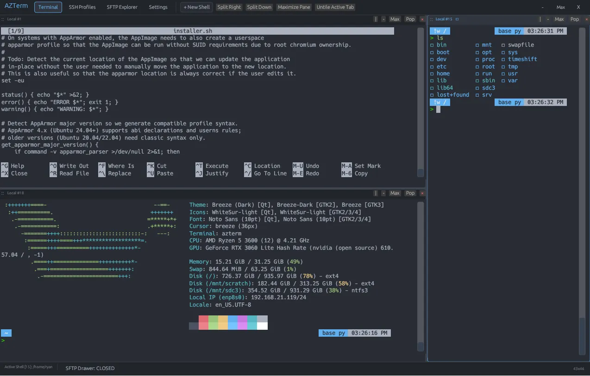

# AZTerm

AZTerm is a fast, lightweight, and cross-platform native terminal emulator, SSH bookmark manager, dual-session SFTP client, and tiling workspace manager written in pure Rust.

Built with hardware-accelerated immediate-mode GPU graphics, AZTerm provides a fluid, responsive interface with zero Electron or Chromium web overhead, maintaining an ultra-low memory footprint (~20 MB to 45 MB RAM) and sub-30ms startup times.

<p align="center">
  
</p>

---

## One-Line Install (Pipe to Bash)

Run this command in your terminal to automatically compile, install, and configure AZTerm with full desktop integration:

```bash
curl -sSL https://raw.githubusercontent.com/AZBrandCanada/azTerm/main/install.sh | bash
```

Or using `wget`:

```bash
wget -qO- https://raw.githubusercontent.com/AZBrandCanada/azTerm/main/install.sh | bash
```

---

## Direct Downloads (Precompiled Releases)

Pre-compiled standalone release binaries:

* **Universal Linux AppImage:** [Download AZTerm-x86_64.AppImage](https://github.com/AZBrandCanada/azTerm/releases/latest/download/AZTerm-x86_64.AppImage)
* **Debian / Ubuntu Package:** [Download azterm_0.2.3_amd64.deb](https://github.com/AZBrandCanada/azTerm/releases/latest/download/azterm_0.2.3_amd64.deb)
* **Generic Linux Tarball:** [Download azterm-linux-x86_64.tar.gz](https://github.com/AZBrandCanada/azTerm/releases/latest/download/azterm-linux-x86_64.tar.gz)
* **Windows 64-bit Archive:** [Download azterm-windows-x86_64.zip](https://github.com/AZBrandCanada/azTerm/releases/latest/download/azterm-windows-x86_64.zip)
* **macOS Universal Package:** [Download azterm-macos-universal.tar.gz](https://github.com/AZBrandCanada/azTerm/releases/latest/download/azterm-macos-universal.tar.gz)

To view all versions and changelogs, visit the [AZTerm Releases Page](https://github.com/AZBrandCanada/azTerm/releases).

---

## Core Feature Highlights

### 1. High-Performance Native Terminal Engine
* **Pure Rust & Hardware Accelerated:** Immediate-mode rendering with direct GPU acceleration and zero web runtime latency.
* **Deep Scrollback History:** Retains up to 50,000 lines of scrollback history per session with smooth scrolling, interactive scrollbar, and Shift+PageUp / PageDown navigation.
* **Smart Progress Bar & Unicode Handling:** Correct handling of wide characters, box-drawing glyphs, and carriage returns (`\r`) prevents system update logs (`pacman`, `apt`, `cargo`, `dnf`) from collapsing onto a single line.
* **Copy on Select & Right-Click Paste:** Highlighting text automatically copies it to the system clipboard upon release; right-clicking writes clipboard contents directly into the active prompt.
* **Persistent Selection Across Scrollback:** Highlighting text anchors to absolute buffer line coordinates, allowing selections to persist and follow the text as you scroll.
* **Dynamic Zoom Engine:** Scale the entire UI and terminal font dynamically with `Ctrl + +`, `Ctrl + -`, `Ctrl + 0`, or `Ctrl + MouseWheel`. Chosen zoom levels are automatically saved to SQLite and restored on boot.
* **Resilient Connection Safeguards:** Background SSH sessions include automated keepalive heartbeats (`ServerAliveInterval=15`, `ServerAliveCountMax=3`, `ConnectTimeout=10`, `TCPKeepAlive=yes`), eliminating freezing or UI locking on high-latency or unstable network links.

### 2. Advanced Dual-Session SFTP File Explorer
* **Direct VPS-to-VPS In-Memory Streaming:** Transfer files and whole directory trees directly between two remote SSH servers using an in-memory proxy pipe. Transfers execute concurrently without writing temporary files to your local SSD, eliminating disk wear and saving local storage.
* **Automated Sudo Elevation on Permission Denied:** When a transfer encounters a `Permission denied` error (e.g. root-owned scripts or protected directories like `/var/www`), AZTerm pauses the queue and prompts for your sudo password. Credentials are securely validated via base64 PAM pipes and cached in memory for that session.
* **Real-Time EMA Transfer Progress & Live ETAs:** A 100ms sampling engine calculates instantaneous and exponential moving average (EMA) throughput. Live metrics display the current batch counter (`[1/4]`), transferred versus total size, bytes remaining, speed (`MB/s`), and dynamic time to completion (`ETA: 14s`).
* **Fluid 20+ FPS Transfer Animation:** The transfer engine requests background frame repaints so progress bars and speed meters move continuously across the screen without pausing or snapping.
* **Accurate Directory Payload Calculation:** Folders are recursively measured (`du -sb` / local tree walks) prior to streaming, ensuring accurate progress tracking for large multi-gigabyte folder archives.
* **Central Transfer Action Bridge:** The middle pane features directional transfer buttons (`-->` and `<--`) with context-aware labels (**Upload**, **Download**, **VPS -> VPS**) and file selection summaries (`Multiple (4) [14.2 MB]`).
* **Full Context Menu & File Management:** Right-click any file or directory for quick access to `+ New Folder`, `Rename`, `Move to...`, and `Delete`.
* **Quick-Search & Letter-Key Cycling:** Type any character (such as `b`) while focused on the file list to immediately jump to and cycle through matching files, automatically scrolling the viewport to center on the active entry.
* **Sortable Column Headers:** Interactive headers for `Name`, `Size`, and `Permissions` with direction indicators (`[^]` / `[v]`). Folders remain grouped at the top while sorting applies cleanly to all entries.
* **Extension-Preserving Truncation:** Long filenames are truncated with smart middle ellipsis preserving the file extension (e.g. `filename-long-name...zip`) without vertical wrapping. Full details are displayed in hover tooltips.
* **Persistent Remote Directory Memory:** Navigated folders on remote servers are automatically remembered in SQLite (`ssh_last_paths`) so reconnecting returns you to your previous directory.
* **Home Directory Jump:** Includes a dedicated `Home` button on each pane to jump directly to the user's home folder (`$HOME` or `/home/<user>`, `/root`).

### 3. Real-Time Terminal Path Synchronization (`sftp_path_sync`)
* **Shell Following:** Changing directories in your shell prompt (`cd /var/www/html`) automatically updates the SFTP pane to display that folder in real time.
* **Multi-Layer Detection:** Inspects Linux `/proc/<pid>/cwd`, OSC 0 / OSC 2 terminal window titles (`\e]0;\u@\h: \w\a`), and screen prompt formats (`user@host:path$`).
* **Host & Session Isolation:** Path sync strictly validates `current_sftp_prof.id == session_profile_id` so commands on machine A never affect machine B.
* **Non-Intrusive State Tracking:** Only triggers when a genuine directory change occurs, preventing SFTP folder navigation from being overridden while browsing files.
* **Dual-Tier Vertical SFTP Sync Drawer:** Toggle the SFTP drawer in the terminal view to open a two-tier vertical workspace on the right side of your shell (Top: Local/Source, Middle: `[v] Upload` / `[^] Download` Action Bar, Bottom: Remote/Target).

### 4. Interactive Tiling & Split Panes
* **Instant Splits:** Split any active pane side-by-side (`Split Right`) or stacked (`Split Down`) using top bar controls or hotkeys (`Ctrl+Shift+D` / `Ctrl+Shift+E`).
* **Visual Drag-and-Drop Docking:** Drag any pane by its title bar (`::`) or any tab header onto another pane's dock zones (Left, Right, Top, Bottom) with live snap-preview highlights.
* **Draggable Dividers:** Freely resize width and height ratios between tiled panes by dragging the divider with the mouse.
* **Slim In-Pane Control Bar:** Each tiled pane features an in-pane strip showing its title, active focus indicator, split shortcuts, full-pane maximize (`Max`), pop-out to separate tab (`Pop`), and close (`x`).
* **Auto-Hiding Tab Line:** When working in a single-pane tab, the second-row tab bar auto-hides to maximize vertical screen space, reappearing as soon as multiple tabs or splits exist.
* **Chunked Grid Tiling:** Tile open sessions into balanced grids in batches of up to 16 panes per tab.

### 5. 16-Preset Theme Engine & Live Customization
* **16 Built-in Theme Presets:**
  * **Cyber Cyan (Default):** Deep tech cyan and slate navy.
  * **Sakura Blossom:** Soft cherry blossom pink on deep dark plum.
  * **Rose Pine:** Muted rose blush, gold highlights, and velvet pine undertones.
  * **Bubblegum Pink:** High-contrast candy pink and pastel magenta on blackberry.
  * **Lavender Mist:** Calming pastel lilac and soft violet on slate plum.
  * **Sunset Coral:** Warm coral peach and golden sunset apricot.
  * **Catppuccin Frappe:** Warm pastel rosewater, flamingo, and mauve.
  * **Emerald Forest:** Deep alpine evergreen, jade accents, and soft mint text.
  * **Amber Glow:** Retro amber and golden honey on obsidian.
  * **Dracula:** High-contrast purple, pink, and green.
  * **Nord:** Arctic blue, muted teal, and snow storm white.
  * **Tokyo Night:** Deep indigo, neon blue, and purple accents.
  * **One Dark:** Classic balanced developer dark palette.
  * **Monokai Pro:** High-contrast yellow, magenta, and charcoal.
  * **Matrix Green:** Monochrome terminal green phosphor.
  * **Solarized Dark:** Low-contrast teal, blue, and solarized cyan.
* **Real-Time Palette Customizer:** Edit any color swatch with live preview pickers and duplicate presets as custom themes.
* **Full 16-Color ANSI Terminal Palette:** Customize standard and bright ANSI colors directly in Settings so command line utilities (`ls`, `btop`, `htop`, syntax highlighters) match your theme.
* **Adjustable Window Transparency:** Control background opacity from 20% to 100% with a real-time slider.
* **OS Native vs. Custom Window Bar:** Switch between native OS window manager decorations and AZTerm's integrated title bar featuring draggable top areas, double-click maximize, and 8-zone edge/corner resizing.

### 6. Advanced SSH & Keypair Manager
* **Built-in Key Generator:** Generate Ed25519, RSA-4096, ECDSA-384, or ECDSA-256 keypairs with one-click public key copying for remote `~/.ssh/authorized_keys`.
* **Inline Key Pasting & Secure Permissions:** Paste OpenSSH private keys directly into profile dialogs with automatic `chmod 0600` enforcement in `~/.config/azterm/keys/`.
* **Profile Management:** Organize servers with custom ports, usernames, identity files, and group tags.
* **Multiplex Socket Health Validation:** Automatically verifies `ControlPath` socket responsiveness via `ssh -O check`, cleaning up dead sockets before initiating new connections.

### 7. Reliable Auto-Update Manager
* **SQLite Update Persistence:** When an update is detected on GitHub, it is saved into your local database (`pending_update`). The `Update: vX.X.X` button remains visible in the bottom status bar across restarts until updated.
* **Automatic Version Recognition:** Upon launching an updated version, AZTerm recognizes the new version tag, clears the update notification, and cleans up the cache.
* **Delayed Boot Check (30 Seconds):** To ensure fast startup times, background release checks wait 30 seconds after bootup before querying the GitHub API (with a 10s timeout to prevent hanging).
* **One-Click Script Updates:** Run the official installer script directly inside a dedicated terminal tab to update the application in place.

### 8. Native Desktop Integration & Workspace Persistence
* **File Manager Context Menus:** Right-click any folder or background in **KDE Dolphin**, **GNOME Nautilus**, or **Nemo** to select **Open in AZTerm Here**.
* **URI Protocol Handlers:** Registers `ssh://` and `sftp://` URI schemes with your desktop environment.
* **Full Session Restoration:** Open tabs, tiled layouts, split ratios, active profiles, themes, zoom levels, and settings are saved automatically to `~/.config/azterm/azterm.db` and restored on relaunch.

---

## Keyboard Shortcuts

| Shortcut | Action |
| :--- | :--- |
| **`Ctrl + Shift + D`** | Split active pane horizontally (side-by-side) |
| **`Ctrl + Shift + E`** | Split active pane vertically (stacked) |
| **`Ctrl + Shift + M`** | Toggle maximize/restore active pane |
| **`Ctrl + Shift + W`** | Close focused pane |
| **`Alt + Arrow Keys`** | Switch focus between tiled panes |
| **`Ctrl` + `+` / `Ctrl` + `=`** | Zoom in (+10%) |
| **`Ctrl` + `-`** | Zoom out (-10%) |
| **`Ctrl` + `0`** | Reset zoom to 100% |
| **`Ctrl` + Mouse Wheel** | Zoom in / Zoom out |
| **`Shift + PageUp`** | Scroll terminal history up |
| **`Shift + PageDown`** | Scroll terminal history down |
| **`Shift + Home`** | Jump to oldest scrollback history |
| **`Shift + End`** | Snap back to live prompt |
| **`Ctrl + Shift + C`** | Copy selected text |
| **`Ctrl + Shift + V`** | Paste from clipboard |
| **`Delete`** | Delete selected files/folders in active SFTP pane |
| **`A` - `Z`** | Quick-search & cycle through matching files in SFTP pane |

---

## Manual Installation by Distribution

### Arch Linux / CachyOS / Manjaro
```bash
git clone https://github.com/AZBrandCanada/azTerm.git
cd azTerm
./install-arch.sh
```

### Fedora
```bash
git clone https://github.com/AZBrandCanada/azTerm.git
cd azTerm
./install-fedora.sh
```

### Ubuntu / Debian / Linux Mint / Pop!_OS
```bash
git clone https://github.com/AZBrandCanada/azTerm.git
cd azTerm
./install-debian.sh
```

---

## Command Line Usage

AZTerm supports standard terminal CLI parameters:

```bash
# Open default shell / restore previous workspace
azterm

# Open AZTerm directly in a specific directory
azterm /var/log
azterm -d /home/user/projects

# Connect directly to an SSH host
azterm ssh://root@192.168.1.100:22

# Launch directly into the SFTP file manager
azterm --sftp

# Execute a command in a new terminal session
azterm -e htop
```

---

## Multi-Platform Packaging

To generate all distribution packages into the `dist/` directory:

```bash
./package-all.sh
```

Outputs generated:
* `dist/AZTerm-x86_64.AppImage` (Universal Linux standalone binary)
* `dist/azterm-0.2.3-1-x86_64.pkg.tar.zst` (Arch Linux native package)
* `dist/azterm_0.2.3_amd64.deb` (Debian / Ubuntu package)
* `dist/azterm-linux-x86_64.tar.gz` (Generic Linux archive)
* `dist/azterm-windows-x86_64.zip` (Windows 64-bit executable archive)

---

## Uninstallation

To remove AZTerm, its desktop launchers, and file manager context menus from your system:

```bash
./uninstall.sh
```

To also remove all saved SQLite configuration history and session data:
```bash
rm -rf ~/.config/azterm
```

---

## License

Dual-licensed under either the MIT License or the Apache License (Version 2.0).
