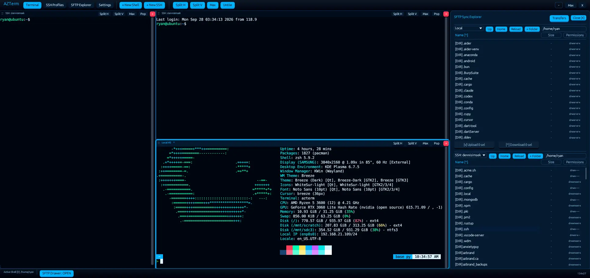

# AZTerm

AZTerm is a fast, lightweight, and cross-platform native terminal emulator, SSH bookmark manager, dual-session SFTP client, and tiling workspace manager written in pure Rust.

Built with hardware-accelerated immediate-mode GPU graphics, AZTerm provides a fluid, responsive interface with zero Electron or Chromium web overhead, maintaining an ultra-low memory footprint (~20 MB to 45 MB RAM) and sub-30ms startup times.

<p align="center">
  
</p>

---

## One-Line Install (Pipe to Bash)

Run this command in your terminal to automatically compile, install, and configure AZTerm with full desktop integration:

```bash
curl -sSL https://raw.githubusercontent.com/AZBrandCanada/azTerm/main/install.sh | bash
```

Or using `wget`:

```bash
wget -qO- https://raw.githubusercontent.com/AZBrandCanada/azTerm/main/install.sh | bash
```

---

## Direct Downloads (Precompiled Releases)

Pre-compiled standalone release binaries:

* **Universal Linux AppImage:** [Download AZTerm-x86_64.AppImage](https://github.com/AZBrandCanada/azTerm/releases/latest/download/AZTerm-x86_64.AppImage)
* **Debian / Ubuntu Package:** [Download azterm_0.1.0_amd64.deb](https://github.com/AZBrandCanada/azTerm/releases/latest/download/azterm_0.1.0_amd64.deb)
* **Generic Linux Tarball:** [Download azterm-linux-x86_64.tar.gz](https://github.com/AZBrandCanada/azTerm/releases/latest/download/azterm-linux-x86_64.tar.gz)
* **Windows 64-bit Archive:** [Download azterm-windows-x86_64.zip](https://github.com/AZBrandCanada/azTerm/releases/latest/download/azterm-windows-x86_64.zip)
* **macOS Universal Package:** [Download azterm-macos-universal.tar.gz](https://github.com/AZBrandCanada/azTerm/releases/latest/download/azterm-macos-universal.tar.gz)

To view all versions and changelogs, visit the [AZTerm Releases Page](https://github.com/AZBrandCanada/azTerm/releases).

---

## Core Feature Highlights

### 1. Background Daemon — Persistent Sessions That Survive Everything

AZTerm's PTYs are owned by a small background process (`azterm --daemon`) that runs independently of the GUI. Closing the window does **not** kill your shells, SSH connections, or long-running commands — they keep running, and the next time you open AZTerm they reattach exactly where they left off.

* **Survives Window Close:** Close AZTerm with a `cargo build` running in one tab and an SSH session in another; reopen it and both are still live, in the same tiling layout, at the same scrollback position.
* **Auto-Reattach on Boot:** On startup, AZTerm queries the daemon for live sessions and rebuilds the previous layout. Each reattached pane shows a green "Reattached to live daemon session #N — process still running" note so you know it's genuinely continuous.
* **Preserved Session IDs:** Session and split IDs are carried across restarts, so saved layouts, per-tab titles, and tiling ratios all line up.
* **Protocol Version Handshake:** The GUI and daemon negotiate a wire-protocol version on every connect. When you install an update that changes the protocol, the new GUI detects the old daemon, replaces it automatically, and spawns a fresh one — no orphaned sockets, no silent incompatibilities, no "why did my SSH tab stop working after updating".
* **Graceful Shutdown:** Toggling **Keep Sessions Running in Background** off in Settings brings up a confirmation modal showing how many live sessions will end, then SIGTERMs every child and exits the daemon cleanly. Cancelling puts the setting back.
* **Zombie-Free Process Management:** Every shell or SSH process the daemon spawns is reaped by a dedicated waiter thread the instant it exits. No `<defunct>` entries accumulate even after dozens of session lifecycles.
* **Kernel-Level Singleton:** An exclusive `flock` on `~/.config/azterm/daemon.lock` guarantees only one daemon can ever run, so two GUI windows racing at startup can't steal each other's sessions.
* **Disk-Backed Scrollback:** Up to 1 MB of raw PTY output per session is persisted to `~/.config/azterm/scrollback/`. Reopening a session replays the history into the terminal parser before the fresh shell prompt lands, so you see your previous output above the new prompt.
* **In-Memory Replay Buffer:** The daemon keeps a rolling 512 KB byte buffer per session and streams it on attach, so reattached clients get instant scrollback without waiting for disk reads.

> Sessions live in the daemon only when **Settings → Terminal Interaction → Keep Sessions Running in Background** is on (the default). Toggle it off to run everything in-process; toggling on takes effect on next launch.

### 2. High-Performance Native Terminal Engine
* **Pure Rust & Hardware Accelerated:** Immediate-mode rendering with direct GPU acceleration and zero web runtime latency.
* **Deep Scrollback History:** Retains up to 50,000 lines of scrollback per session (configurable) with smooth scrolling, an interactive scrollbar, and Shift+PageUp / PageDown / Home / End navigation.
* **Smart Progress Bar & Unicode Handling:** Correct handling of wide characters, box-drawing glyphs, and carriage returns (`\r`) prevents system update logs (`pacman`, `apt`, `cargo`, `dnf`) from collapsing onto a single line.
* **Copy on Select & Right-Click Paste:** Highlighting text copies it to the system clipboard on release; right-click writes clipboard contents into the active prompt. Both behaviours are independently toggleable in Settings.
* **Persistent Selection Across Scrollback:** Highlights anchor to absolute buffer coordinates so a selection keeps tracking its text as you scroll.
* **Multi-Screen TUI Selection:** Drag-select inside `nano`, `less`, `vim`, `htop`, or any full-screen TUI and page the app with the wheel mid-drag. On release, AZTerm stitches every captured frame into one coherent text block on your clipboard.
* **Smart Wheel Routing:** The mouse wheel scrolls AZTerm's own scrollback in a normal shell, but is automatically forwarded to the application (as PageUp/PageDown) when a TUI owns the screen.
* **Configurable Wheel Speed:** Choose 1, 3, 5, or 10 lines per wheel notch, or half/full page per notch.
* **Dynamic Zoom Engine:** Scale the entire UI and terminal font with `Ctrl + +`, `Ctrl + -`, `Ctrl + 0`, or `Ctrl + MouseWheel`. Zoom levels are persisted to SQLite and restored on boot.
* **Resilient Connection Safeguards:** SSH sessions are opened with `ServerAliveInterval=15`, `ServerAliveCountMax=3`, `ConnectTimeout=10`, `TCPKeepAlive=yes`, and ControlMaster multiplexing (`ControlPersist=5m`) for instant reconnects.
* **Resilient Clipboard Engine:** All clipboard I/O runs on a dedicated worker thread with a 600 ms timeout, so a hung compositor can never freeze the UI. Wayland data-control is handled without deadlocking.
* **Auto-Recovering Focus:** If egui loses widget focus (Wayland, WM hints, cursor leaving the window for a frame), the terminal silently re-requests it and keeps accepting keystrokes — no more mashing Enter to get your shell back.
* **Robust Font Handling:** Fonts are validated by magic bytes before loading; unsupported formats (`.ttc`, `.woff`, `.woff2`) are skipped instead of panicking the renderer.
* **Backspace Code Compatibility:** Switch the code sent on Backspace between `^?` (0x7F) and `^H` (0x08) in Settings for legacy or unusual shells.

### 3. Advanced Dual-Session SFTP File Explorer
* **Direct VPS-to-VPS In-Memory Streaming:** Transfer files and whole directory trees directly between two remote SSH servers via an in-memory proxy pipe. No temporary files touch your local disk.
* **Automated Sudo Elevation on Permission Denied:** When a transfer hits `Permission denied`, AZTerm pauses the queue and prompts for a sudo password. Credentials are validated via base64 PAM pipes and cached in memory for the session.
* **Real-Time EMA Transfer Progress & Live ETAs:** A 100 ms sampling engine calculates instantaneous and exponential moving average throughput. Displays batch counter (`[1/4]`), transferred / total size, remaining bytes, speed (`MB/s`), and dynamic `ETA`.
* **Fluid 20+ FPS Transfer Animation:** Background frame repaints keep progress bars and speed meters moving smoothly.
* **Accurate Directory Payload Calculation:** Folders are recursively measured (`du -sb` / local tree walks) before streaming.
* **Central Transfer Action Bridge:** The middle pane features `-->` and `<--` buttons with context-aware labels (**Upload**, **Download**, **VPS → VPS**) and inline file-selection summaries (`Multiple (4) [14.2 MB]`).
* **Directional Badges:** Each transfer row is badged `UPLOAD` / `DOWNLOAD` / `VPS → VPS` for instant visual scanning.
* **Transfer Cancellation & Restart:** Cancel any queued or in-progress transfer. Failed or cancelled transfers expose a **Restart** button that re-queues them from the original recipe.
* **Sticky Toolbar Indicator:** The Transfers button carries a status dot — red while a transfer is active or has failed, green once everything has completed.
* **Transfer History Window:** A dedicated modal shows all transfers with progress bars, percentages, ETAs, speeds, timestamps, error messages, and per-row Cancel/Restart.
* **Full Context Menu & File Management:** Right-click any file or directory for `+ New Folder`, `Rename`, `Move to...`, and `Delete`.
* **Multi-Item Operations:** Ctrl / Shift-click to multi-select, then delete, move, or transfer the whole set in one batch.
* **Quick-Search & Letter-Key Cycling:** Type a character to jump to the first matching file; type it again to cycle through all matches. The viewport auto-scrolls to keep the active entry centred.
* **Keyboard Delete:** Press `Delete` on any selection to open the delete confirmation.
* **Sortable Column Headers:** Interactive `Name`, `Size`, and `Permissions` headers with direction indicators (`[^]` / `[v]`). Folders always group to the top.
* **Extension-Preserving Truncation:** Long filenames collapse to `very-long-name...zip` — extension preserved, no vertical wrapping. Full names appear in hover tooltips.
* **Persistent Remote Directory Memory:** Navigated folders on remote servers are remembered in SQLite (`ssh_last_paths`) and restored on reconnect.
* **Home Directory Jump:** A `Home` button on each pane jumps to `$HOME` / `/home/<user>` / `/root`.
* **Automatic Socket Health Validation:** `ControlPath` sockets are checked via `ssh -O check`; dead sockets are removed before a new connection is attempted.
* **Live Auth Status Detection:** If authentication is required, the pane shows a **Login & Authenticate** button that opens an interactive SSH modal — the same PTY-based flow you get in a normal terminal tab, so password, key, and 2FA prompts all work.

### 4. Real-Time Terminal ↔ SFTP Path Synchronization (`sftp_path_sync`)
* **Shell Following:** `cd /var/www/html` in your shell and the SFTP pane automatically navigates to that folder.
* **Tab-Aware:** Switching to a different SSH tab immediately re-targets the SFTP pane to that tab's remote and path. Switching back reverses it. No manual pane switching needed.
* **Multi-Layer Detection:** Inspects Linux `/proc/<pid>/cwd`, OSC 0 / OSC 2 terminal window titles (`\e]0;\u@\h: \w\a`), and screen prompt formats (`user@host:path$`).
* **Host & Session Isolation:** Path sync strictly validates `current_sftp_prof.id == session_profile_id` so commands on machine A never affect machine B.
* **Non-Intrusive State Tracking:** Only triggers on genuine directory changes — SFTP folder navigation is never overridden while browsing.
* **Dual-Tier Vertical SFTP Sync Drawer:** Toggle the drawer in the terminal view to open a two-tier vertical workspace on the right side of your shell (Top: Local / Source, Middle: Upload/Download Action Bar, Bottom: Remote / Target).

### 5. Interactive Tiling & Split Panes
* **Instant Splits:** Split any active pane side-by-side (`Split Right`) or stacked (`Split Down`) via top bar controls or hotkeys (`Ctrl+Shift+D` / `Ctrl+Shift+E`).
* **Visual Drag-and-Drop Docking:** Drag any pane by its title bar (`::`) or any tab header onto another pane's dock zones (Left, Right, Top, Bottom) with live snap-preview highlights.
* **Draggable Dividers:** Resize width and height ratios between tiled panes by dragging the divider.
* **Slim In-Pane Control Bar:** Each tiled pane shows its title, active focus indicator, split shortcuts, `Max` (maximize/restore), `Pop` (pop out to a separate tab), and `×` close.
* **Pop-Out to Tab:** Any tiled pane can be detached into its own top-level tab in one click — and dropped back onto another pane's dock zone to re-tile it.
* **Untile:** Split a tiled tab back into one tab per pane with a single click.
* **Auto-Hiding Tab Line:** When only one workspace exists, the tab bar auto-hides to maximize vertical space; it reappears as soon as you split or add tabs.
* **Chunked Grid Tiling:** `Tile All` arranges every open session into balanced grids of up to 16 panes per tab, automatically creating extra tab groups as needed.
* **Pane Focus Cycling:** `Alt + Arrow Keys` moves focus between tiled panes in the current workspace.
* **Configurable Ratios:** Divider drag ratios and split direction are all persisted to the layout DB and restored on restart.

### 6. 30-Preset Theme Engine & Live Customization

**22 dark presets:** Cyber Cyan (Default), Sakura Blossom, Rose Pine, Bubblegum Pink, Lavender Mist, Sunset Coral, Catppuccin Frappé, Emerald Forest, Amber Glow, Dracula, Nord, Tokyo Night, One Dark, Monokai Pro, Matrix Green, Solarized Dark, Synthwave, Toxic Lime, Hot Magenta, Infrared, Ultraviolet, Voltage.

**8 light presets:** Sunshine, Sky Blue, Mint Fresh, Sakura Light, Lavender Light, Peach Cream, Paper Slate, Ocean Foam.

* **Real-Time Palette Customizer:** Edit any color swatch with live preview pickers.
* **Full 16-Color ANSI Terminal Palette:** Customize standard and bright ANSI colors directly in Settings so `ls`, `btop`, `htop`, and syntax highlighters match your theme.
* **Text-on-Accent Auto-Pick:** Button and active-tab text colors are chosen automatically via WCAG contrast ratio against the accent color, so labels stay legible no matter how bright or dark your accent is. Override explicitly per theme if you want.
* **Custom Theme Duplication & Deletion:** Clone any preset, rename it, tune it, save it as your own. Builtin themes are protected from accidental deletion.
* **Adjustable Window Transparency:** Slide window opacity from **0% (fully transparent)** to **100% (opaque)**. Transparency applies to the whole window — terminal, panels, tabs, status bar — so it works as a wallpaper mode.
* **Native vs. Custom Title Bar:** Switch between OS window decorations and AZTerm's integrated title bar (draggable, double-click maximize, 8-zone edge/corner resize).

### 7. Font Engine
* **Separate UI and Terminal Fonts:** Pick one typeface for the entire UI (buttons, labels, nav, settings) and a different one for terminal cells.
* **Live Font Previews:** Every entry in the font dropdown renders *in its own typeface*, so you can see what you're choosing before you commit.
* **Monospace-Only Terminal Fonts:** The Terminal Font picker queries fontconfig's `spacing=90` property and hides proportional fonts, since terminal cells require monospaced layout.
* **Configurable Terminal Font Size:** 6pt to 32pt slider with a live preview line so you can dial in your ideal readability.
* **Live Font List Rescan:** A `↻` button re-queries installed fonts without restarting.
* **Safe Font Loading:** Fonts are validated by magic bytes before being handed to the renderer. Malformed or unsupported files are skipped silently rather than crashing the app.

### 8. Advanced SSH & Keypair Manager
* **Built-in Key Generator:** Generate Ed25519, RSA-4096, ECDSA-384, or ECDSA-256 keypairs with one-click public key copy for `~/.ssh/authorized_keys`.
* **Inline Key Pasting & Secure Permissions:** Paste OpenSSH private keys directly into profile dialogs with automatic `chmod 0600` enforcement in `~/.config/azterm/keys/`.
* **Saved Keypair Manager:** Every key AZTerm generates or imports is listed with its path, copy-public-key button, and a "New Profile with Key" shortcut.
* **Profile Management:** Custom ports, usernames, identity files, and group tags per server.
* **Interactive Auth Modal:** When a session needs a password, OTP, or host-key confirmation, AZTerm opens a modal that streams live PTY output from the SSH process, so you can respond to any prompt.
* **Multiplex Socket Health Validation:** Automatically verifies `ControlPath` sockets with `ssh -O check`, cleaning up dead ones before initiating new connections.
* **Direct URL Launch:** `azterm ssh://user@host:22` opens a session immediately. `sftp://` URLs open straight into the SFTP browser.

### 9. Reliable Auto-Update Manager
* **Install Method Detection:** Recognises AppImage, script-installed, package-managed (pacman/dpkg), Windows, macOS, and manual builds, and tailors the update flow to each.
* **SQLite Update Persistence:** Detected updates are stored in `pending_update` and the `Update: vX.X.X` button remains visible across restarts until the update is applied.
* **Automatic Version Recognition:** Launching an updated build clears the notification and prunes stale entries.
* **Delayed Boot Check:** Background checks wait 30 seconds after boot (with a 10 s timeout) so startup stays fast even on slow networks.
* **One-Click Script Updates:** For script-installed and manual builds, "Update Now" opens a new terminal tab and runs the official installer inside it — you watch the update happen live.

### 10. Native Desktop Integration & Workspace Persistence
* **File Manager Context Menus:** Right-click any folder or background in **KDE Dolphin**, **GNOME Nautilus**, or **Nemo** to select **Open in AZTerm Here**.
* **URI Protocol Handlers:** Registers `ssh://` and `sftp://` schemes with your desktop environment.
* **Full Session Restoration:** Open tabs, tiled layouts, split ratios, active profiles, themes, zoom levels, and settings are saved to `~/.config/azterm/azterm.db` and restored on relaunch.
* **Layout Self-Healing:** Every frame, AZTerm reconciles the workspace tree against the live session set — closed sessions are pruned, single-child splits collapse, empty workspaces are dropped, and tab titles update to reflect actual pane counts. Corrupt or partial saved layouts are detected and discarded rather than crashing on restore.
* **Collision-Free Tab IDs:** New tabs spawned after a restore always allocate IDs above every loaded workspace, so per-widget IDs never collide — recovering a session never breaks the close button on a restored tab.

### 11. Settings & Diagnostics
* **Tabbed Preferences:** Themes & Window, Terminal Interaction, Shell & Environment, SFTP & Transfers, and Application & System categories.
* **Default Shell Presets:** One-click `bash` / `zsh` / `fish` selection, or type any absolute path.
* **Debug Logging Mode:** Opt-in timestamped tracing of PTY, SSH, SFTP, and layout operations. Log rotates at 20 MB into `.old`. Configurable path.
* **Panic Hook with Backtrace:** Any panic is captured with a full backtrace written to the debug log before the default hook runs, so you get useful crash reports.
* **UI Heartbeat:** In debug mode, a heartbeat line is written every 5 seconds with the current view, active session, workspace, and modal state. If the app ever freezes, the last heartbeat timestamp tells you exactly where.
* **Live Status Bar:** Active session info, SFTP drawer state, update availability, transfer status, and terminal grid size (`cols×rows` or `-N lines | cols×rows` when scrolled).
* **Toast Notifications:** Non-blocking status messages for split, tiling, clipboard, transfer, and session operations appear in the bottom bar and fade after 3 seconds.

---

## Keyboard Shortcuts

### Panes & Tabs
| Shortcut | Action |
| :--- | :--- |
| **`Ctrl + Shift + D`** | Split active pane horizontally (side-by-side) |
| **`Ctrl + Shift + E`** | Split active pane vertically (stacked) |
| **`Ctrl + Shift + M`** | Toggle maximize/restore active pane |
| **`Ctrl + Shift + W`** | Close focused pane |
| **`Alt + Arrow Keys`** | Cycle focus between tiled panes |

### Zoom & View
| Shortcut | Action |
| :--- | :--- |
| **`Ctrl` + `+` / `Ctrl` + `=`** | Zoom in (+10%) |
| **`Ctrl` + `-`** | Zoom out (-10%) |
| **`Ctrl` + `0`** | Reset zoom to 100% |
| **`Ctrl` + Mouse Wheel** | Zoom in / Zoom out |

### Terminal Scrollback
| Shortcut | Action |
| :--- | :--- |
| **`Shift + PageUp`** | Scroll terminal history up (by page) |
| **`Shift + PageDown`** | Scroll terminal history down (by page) |
| **`Shift + Home`** | Jump to oldest scrollback history |
| **`Shift + End`** | Snap back to live prompt |
| **`Ctrl + Shift + C`** | Copy selected text |
| **`Ctrl + Shift + V`** | Paste from clipboard |
| **`Shift + Insert`** | Paste from clipboard (alternate) |
| **`Ctrl + Shift + A`** | Select entire scrollback + visible screen |

### Mouse
| Action | Result |
| :--- | :--- |
| **Double-click** | Select word under cursor |
| **Triple-click** | Select entire line |
| **Drag to edge** | Auto-scroll and extend selection |
| **Drag past TUI edge** | Page the running app (nano, less, htop, vim) mid-drag |
| **Wheel mid-drag** | Page the running app while extending selection |
| **Right-click** | Paste clipboard (toggleable) |

### SFTP Pane
| Shortcut | Action |
| :--- | :--- |
| **`Delete`** | Delete selected files/folders |
| **`A` – `Z`** | Quick-search and cycle through matching files |
| **`Ctrl` / `Shift` + Click** | Multi-select files |
| **Right-click** | Context menu: New Folder, Rename, Move, Delete |

---

## Manual Installation by Distribution

### Arch Linux / CachyOS / Manjaro
```bash
git clone https://github.com/AZBrandCanada/azTerm.git
cd azTerm
./install-arch.sh
```

### Fedora
```bash
git clone https://github.com/AZBrandCanada/azTerm.git
cd azTerm
./install-fedora.sh
```

### Ubuntu / Debian / Linux Mint / Pop!_OS
```bash
git clone https://github.com/AZBrandCanada/azTerm.git
cd azTerm
./install-debian.sh
```

---

## Command Line Usage

AZTerm supports standard terminal CLI parameters:

```bash
# Open default shell / restore previous workspace
azterm

# Open AZTerm directly in a specific directory
azterm /var/log
azterm -d /home/user/projects
azterm --working-directory /var/log

# Connect directly to an SSH host
azterm ssh://root@192.168.1.100:22

# Connect and open the SFTP browser to a remote
azterm sftp://user@example.com

# Launch directly into the SFTP file manager
azterm --sftp

# Execute a command in a new terminal session
azterm -e htop
```

Supported flags:

| Flag | Alias | Description |
| :--- | :--- | :--- |
| `-d`, `--dir`, `-w` | `--working-directory` | Open in the given directory |
| `--sftp` | — | Launch into the SFTP browser view |
| `-e`, `--execute` | — | Run the given command and args in the new tab |
| *(positional)* | — | A directory, `file://`, `ssh://`, or `sftp://` URI |

---

## Configuration & Data Locations

| Path | Contents |
| :--- | :--- |
| `~/.config/azterm/azterm.db` | SQLite database: settings, SSH profiles, custom themes, active theme, saved workspaces, saved sessions, per-profile last paths |
| `~/.config/azterm/keys/` | Private keys generated or imported by AZTerm (chmod 0600) |
| `~/.config/azterm/sockets/` | SSH ControlMaster sockets (per profile) |
| `~/.config/azterm/scrollback/` | Per-session raw PTY history (up to 1 MB each) |
| `~/.config/azterm/daemon.sock` | Unix socket for the background daemon |
| `~/.config/azterm/daemon.lock` | Daemon singleton flock file |
| `~/.config/azterm/debug.log` | Debug log (when debug mode is enabled) |

---

## Multi-Platform Packaging

To generate all distribution packages into the `dist/` directory:

```bash
./package-all.sh
```

Outputs generated:
* `dist/AZTerm-x86_64.AppImage` (Universal Linux standalone binary)
* `dist/azterm-linux-x86_64.tar.gz` (Arch Linux native package)
* `dist/azterm_0.1.0_amd64.deb` (Debian / Ubuntu package)
* `dist/azterm-linux-x86_64.tar.gz` (Generic Linux archive)
* `dist/azterm-windows-x86_64.zip` (Windows 64-bit executable archive)

---

## Uninstallation

To remove AZTerm, its desktop launchers, and file manager context menus from your system:

```bash
./uninstall.sh
```

To also remove all saved SQLite configuration, keys, scrollback history, and daemon state:
```bash
rm -rf ~/.config/azterm
```

If a background daemon is still running, stop it first:
```bash
pkill -f 'azterm.*--daemon' || true
```

---

## License

Dual-licensed under either the MIT License or the Apache License (Version 2.0).
